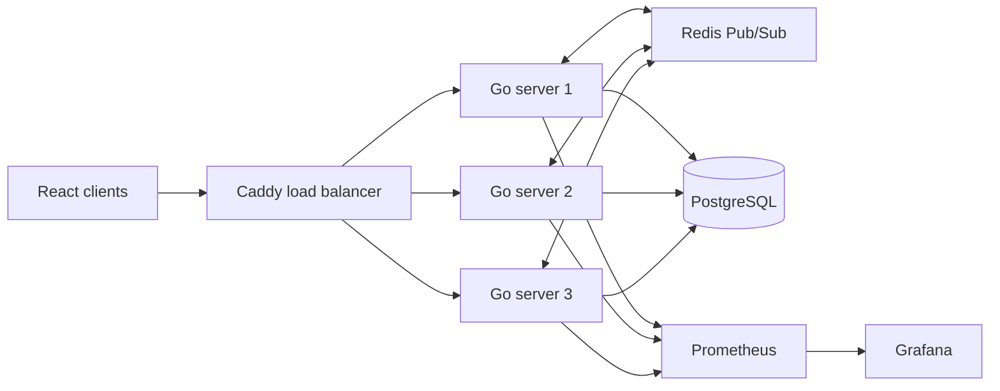

# Distributed Chat App

A completed distributed WebSocket chat system built with Go, React, Redis,
PostgreSQL, Caddy, Docker, Prometheus, and Grafana.

The project explores what happens when chat clients connect to different
server instances. Caddy distributes new WebSocket connections across three Go
servers. Each server manages its own connected clients, while Redis Pub/Sub
keeps messages moving between all three instances.

## What it does

- Creates users and stores them in PostgreSQL.
- Accepts WebSocket connections through Caddy at `/echo`.
- Routes new connections across `ws1`, `ws2`, and `ws3` with round-robin load balancing.
- Saves messages to PostgreSQL before publishing them to Redis.
- Broadcasts Redis messages to clients connected to every server.
- Sends the connected server name to each client so connection placement is visible.
- Reconnects the browser client after a dropped connection with exponential backoff and jitter.
- Exposes Prometheus metrics for active connections, received messages, and published messages.
- Includes a Go traffic generator for exercising message flow and server failure recovery.

## Architecture



When a client sends a message, its Go server stores the message in PostgreSQL
and publishes it to Redis. All server instances subscribe to the same Redis
channel, so each one can broadcast the message to its connected clients.

Existing connections stay on their current server. If a connection drops, the
client retries through Caddy and may be routed to another healthy server.

## Technology

- Backend: Go, Gorilla WebSocket, `go-redis`, pgx, sqlc
- Frontend: React, TypeScript, Vite
- Routing: Caddy with round-robin load balancing
- Data: PostgreSQL for users and messages, Redis for cross-server messaging
- Observability: Prometheus, Grafana, and Node Exporter
- Operations: Docker Compose and shell helpers

## Running the project locally

### 1. Configure PostgreSQL

Create `backend/config/.env` with values for the database container and the
connection string used by the Go servers:

```env
POSTGRES_USER=postgres
POSTGRES_PASSWORD=postgres
POSTGRES_DB=chat
DB_URL=postgres://postgres:postgres@db:5432/chat?sslmode=disable
```

Use a different password outside local development.

Apply the SQL files in `backend/sql/schema` to the database in order:

```text
backend/sql/schema/001_users.sql
backend/sql/schema/002_messages.sql
```

### 2. Start the supporting services

The Compose file expects an external Docker network named `ws-caddy`. Redis
and Caddy are created separately because the three WebSocket server containers
are managed by `servers.sh`.

```sh
docker network create ws-caddy
docker run -d --name redis --network ws-caddy redis:latest
docker run -d --name caddy-balancer \
  --network ws-caddy \
  -p 8880:80 \
  -v "$PWD/Caddyfile:/etc/caddy/Caddyfile:ro" \
  caddy:latest
docker compose up -d
```

### 3. Build and start the WebSocket servers

Build the Go binary, build the server image, then create and start the three
server containers:

```sh
go build -o backend/server/server ./backend/server
docker build -t ws-server .
./servers.sh build
./servers.sh start
```

The Caddy endpoint is now available at `http://localhost:8880`.

### 4. Start the React client

```sh
cd web/chat-app
bun install
bun run dev
```

Open the Vite URL shown in the terminal, normally `http://localhost:5173`.
Enter a username, join the chat, and open multiple browser windows to see
messages cross server boundaries.

## Monitoring

- Grafana: <http://localhost:3000>
- Prometheus: <http://localhost:9090>
- Server metrics: `/metrics` on each Go server

The local Grafana container uses `admin` as its default password. Change it
before exposing the service outside your machine.

The Prometheus metrics include:

- `chat_websocket_connections`
- `chat_messages_received_total`
- `chat_messages_published_total`

## Load testing

With the application running, start the traffic generator from the repository
root:

```sh
go run ./cmd/loadtest -users 100
```

For a bounded run:

```sh
go run ./cmd/loadtest -users 100 -interval 2s -ramp 10s -duration 5m
```

The load tester creates persistent `loadtest-` users and messages. It reports
connections, sends, received broadcasts, reconnects, and errors. It exercises
traffic and recovery, but it is not a latency or delivery-correctness
benchmark. More options are documented in
[`cmd/loadtest/README.md`](cmd/loadtest/README.md).

To exercise recovery, stop one server while the tester is running:

```sh
docker stop ws1
docker start ws1
```

Clients reconnect through Caddy. Existing connections do not move to the
restarted server automatically.

## Tests

Run the Go test suite with the race detector:

```sh
go test -race ./backend/... ./cmd/loadtest
```

The load tester tests cover user creation, message flow, reconnects, shutdown,
and option validation. The server tests cover client cleanup after a
disconnect.

## Repository layout

```text
backend/             Go server, database queries, schema, and metrics
cmd/loadtest/        Go traffic generator and its tests
web/chat-app/        React and TypeScript client
Caddyfile            WebSocket load-balancer configuration
compose.yaml         PostgreSQL and observability services
prometheus.yml       Prometheus scrape configuration
servers.sh           Build, start, stop, and remove server containers
```
